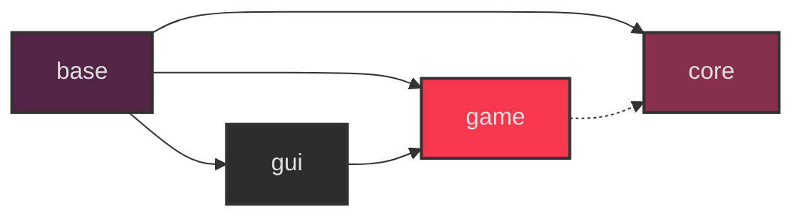

# A tiny game engine/framework

## Deps
```terminal
sudo dnf install git clang clang-devel SDL3 SDL3-devel glew glew-devel -y
dnf debuginfo-install SDL3 #optional
git lfs install
```
## Cloning
This repo uses git LFS for assets and a submodule for stb libraries, you can:
```bash
git clone --recursive https://github.com/eliasvas/prototype
```
## Building
### Linux
```bash
./build.sh
```
### Linux (inside vim)
```
# add these to your .vimrc
nnoremap <F7> :!./build/prototype&<CR>
nnoremap <F7> :!./build.sh<CR>
nnoremap <F6> :!gf2<CR>
nnoremap <F5> :!bash -c 'source ./build.sh && ./build/prototype'<CR>

```
### Web (From Linux)
first install and activate [emscripten](https://emscripten.org/docs/getting_started/downloads.html)
```bash
./build_web.sh
cd build
python -m http.server
->localhost:8000 in your browser
```

### Make your own game to compile with the engine
```
mkdir my_game
cp prototype my_game
cd my_game
cp prototype/demo ./game
cp prototype/data ./data
make your own build.sh
```

#### Sample _build.sh_ for external game
```
#!/usr/bin/env bash
set -e

ENGINE_DIR="./prototype"
GAME_DIR="./game"
OUTPUT_DIR="./build"
"$ENGINE_DIR/build.sh" gd="$GAME_DIR" od="$OUTPUT_DIR"
```


## Module Architecture

